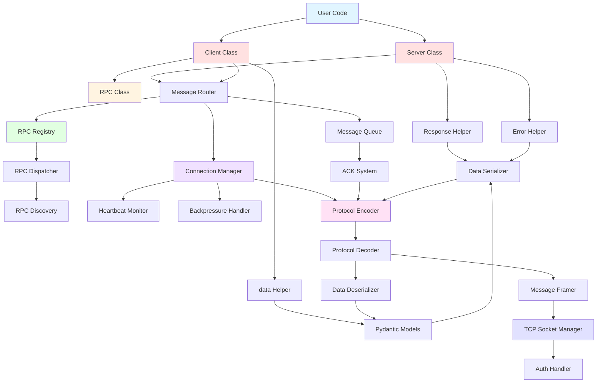

# System Architecture Diagram

This diagram shows the overall system architecture with all layers and components.

## Layer Breakdown

### User Application Layer
- **User Code** - Your application code using Conduit

### Public API Layer
- **Server Class** - Server-side API
- **Client Class** - Client-side API
- **RPC Class** - RPC call interface
- **Response/Error/data Helpers** - Convenience wrappers

### Data Layer
- **Pydantic Models** - Type-safe data models
- **Serializer/Deserializer** - Pydantic ↔ bytes conversion

### RPC Layer
- **RPC Registry** - Stores registered RPC methods
- **RPC Dispatcher** - Routes and executes RPC calls
- **RPC Discovery** - Lists available methods

### Messaging Layer
- **Message Router** - Routes messages to handlers
- **Message Queue** - Send/receive buffers
- **ACK System** - Message acknowledgments

### Connection Layer
- **Connection Manager** - Manages connections
- **Heartbeat Monitor** - Connection health
- **Backpressure Handler** - Flow control

### Protocol Layer
- **Encoder/Decoder** - Binary protocol conversion
- **Message Framer** - Message framing and buffering

### Transport Layer
- **TCP Socket Manager** - Raw TCP sockets
- **Auth Handler** - Password authentication
