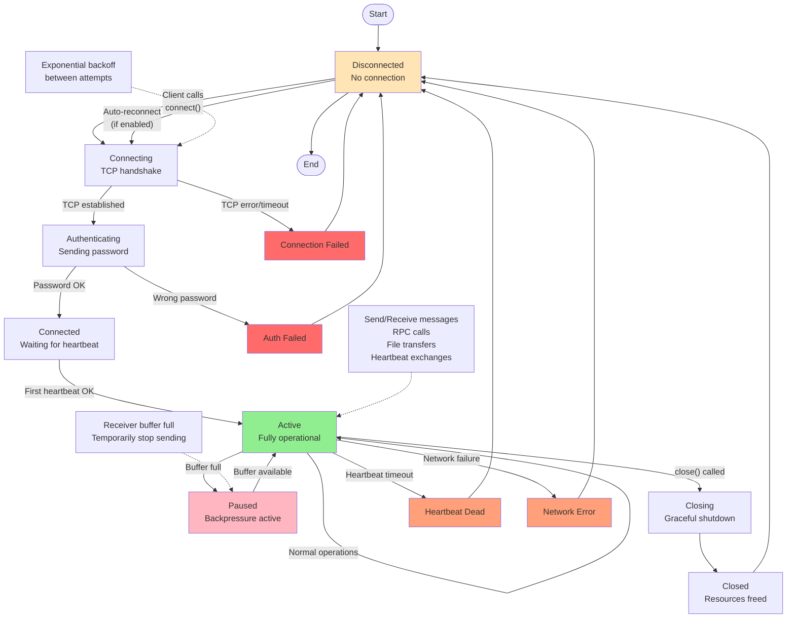

# Connection Lifecycle Diagram

This diagram shows the complete lifecycle of a connection from initial state through various states to disconnection.

## State Descriptions

| State | Description |
|-------|-------------|
| **Disconnected** | No connection, idle state |
| **Connecting** | TCP connection in progress |
| **Authenticating** | Sending password, waiting for auth response |
| **Connected** | Authenticated, waiting for first heartbeat |
| **Active** | Fully operational, can send/receive |
| **Paused** | Flow control active, temporary pause |
| **Closing** | Graceful shutdown in progress |
| **Closed** | Connection closed, resources cleaned up |
| **HeartbeatDead** | Heartbeat timeout detected |
| **NetworkError** | Network failure detected |
| **ConnectionFailed** | Failed to establish TCP connection |
| **AuthFailed** | Authentication failed |

