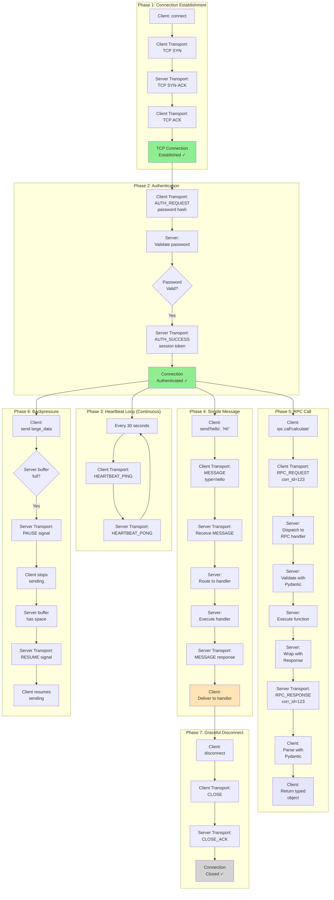

# Message Flow Diagram

This diagram shows the complete message flow between client and server for various operations.

## Message Types

| Type | Direction | Purpose |
|------|-----------|---------|
| **AUTH_REQUEST** | Client → Server | Send password hash |
| **AUTH_SUCCESS** | Server → Client | Authentication OK |
| **MESSAGE** | Bidirectional | Regular message |
| **RPC_REQUEST** | Client → Server | Call RPC method |
| **RPC_RESPONSE** | Server → Client | RPC result |
| **RPC_ERROR** | Server → Client | RPC error |
| **HEARTBEAT_PING** | Bidirectional | Check connection alive |
| **HEARTBEAT_PONG** | Bidirectional | Respond to ping |
| **PAUSE** | Bidirectional | Stop sending (backpressure) |
| **RESUME** | Bidirectional | Resume sending |
| **CLOSE** | Bidirectional | Request connection close |
| **CLOSE_ACK** | Bidirectional | Acknowledge close |

